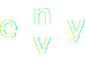

<div align="center">

<picture>
  <source media="(prefers-color-scheme: light)" srcset="docs/_static/envy-light.svg">
  
</picture>

**Vectorization in Python, made convenient.**

</div>

## Installation
```bash
pip install git+https://github.com/nicomignoni/envy.git@master
```

## Quickstart
`NV`s are *named vectorizations*. They allow you to vectorize `np.ndarrays` (and scalars), while still being to retrieve the initial arrays. 

```python
from envy import NV
import numpy as np

a = np.random.rand(2,4,3)
b = np.random.rand(3,2)
c = np.random.rand(3)
d = 4

x = NV(a=a, b=b, c=c, d=d)

>>> x
34-element NV with layout:
a: Array (2, 4, 3) [0-24)
b: Matrix (3, 2) [24-30)
c: 3-elements Vector [30-33)
d: Number [33-34)
[7 0 3 0 0 6 0 1 8 5 5 7 9 2 0 3 0 8 1 0 3 7 3 4 3 2 9 9 9 0 0 3 6 4]
```

`NV`s behave just like the usual vectorization of the defined terms
```python
v = np.concatenate([a.flatten(), b.flatten(), c.flatten(), [d]])
>>> np.array_equal(x, v)
True
```
however, you can still easily access the initial terms by their name, as you would do with a `dict`
```python
>>> x["a"]
array([[[7, 0, 3],
        [0, 0, 6],
        [0, 1, 8],
        [5, 5, 7]],

       [[9, 2, 0],
        [3, 0, 8],
        [1, 0, 3],
        [7, 3, 4]]])

>>> x["b"]
array([[3, 2],
       [9, 9],
       [9, 0]])

>>> x["c"]
array([0, 3, 6]

>>> x["d"]
array(4)
```
`NV`s behave like `numpy` vectors: when possible, operations on one or more `NV`s still return an `NV`; otherwise, they fall back to the appropriate `np.ndarray`. For more details, check out the docs. 


